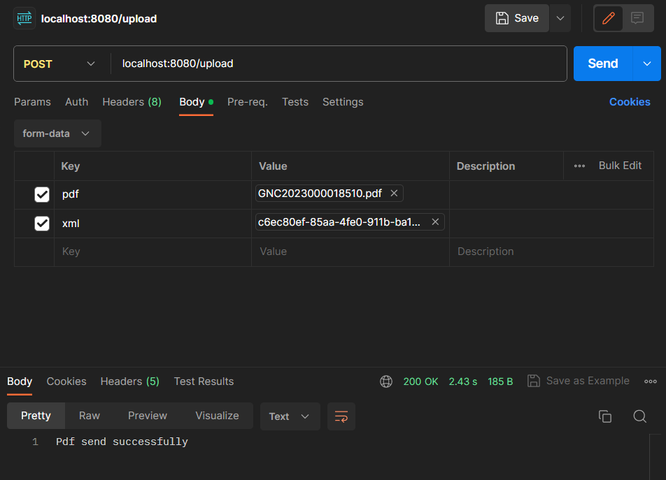

# Mail 2 Operator

This project automates the process of sending invoices generated by the system to the export operator. It receives PDF and XML files via HTTP requests and extracts variables from the XML. The variables are then used to send an email with the PDF attachment using Spring Boot Starter Mail. In this way, I reduce my daily routine work in my company where I work on accounting and ERP.

## Prerequisites

Before running the project, ensure that the following prerequisites are met:

- Java Development Kit (JDK) 17 or higher
- Apache Maven installed
- SMTP server credentials (for sending emails)
- Spring Boot Starter Web
- Spring Boot Starter Mail

## Getting Started

Follow the steps below to set up and run the project:

- Clone the repository to your local machine: 
  ```
    git clone https://github.com/Eukolos/mail2operator.git
  ```

- Navigate to the project directory and run with maven:
  ```
    cd spring-boot-invoice-export
  
    mvn spring-boot:run
  ```
## Usage
To send an invoice for export, you need to make an HTTP POST request to the appropriate endpoint. Include the PDF and XML files as multipart/form-data in the request body.

Example request using cURL:
```
curl -X POST -F "pdf=@invoice.pdf" -F "xml=@invoice.xml" http://localhost:8080/upload
```
or Postman:




Ensure that the pdf and xml parameters match the file names.

Result:


## Contact

This project was created by [Eukolos](https://github.com/Eukolos). Contributions are welcome! 

If you have any questions or suggestions, feel free to contact the project maintainer at eminaksoy35@gmail.com.
